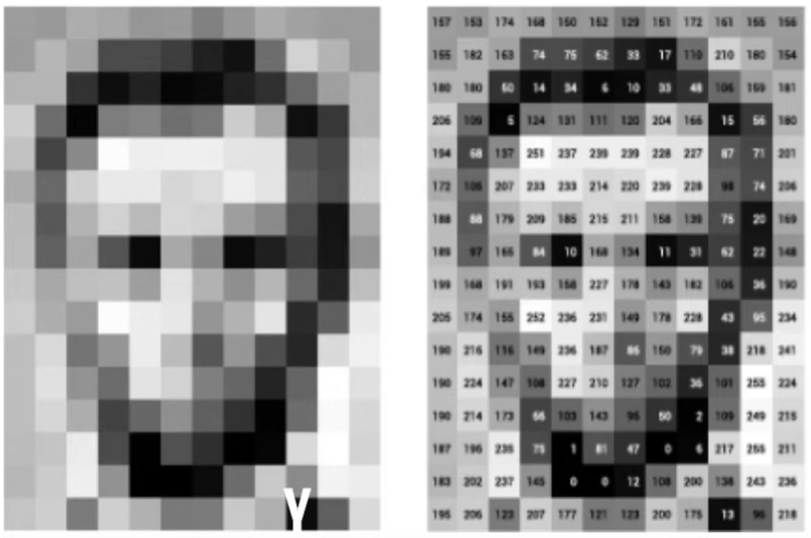

# 📘 Computer Vision

## 📷 What is an Image?

1. 🖼️ **A collection of pixels.**  
2. 🔳 **A pixel** is the smallest unit in an image, containing:  
   - **Color values**: Red, Green, and Blue (RGB).  
   - **Intensity information**: Specific to that point in the image.  
3. 🔍 **Resolution**:  
   - An image is defined by the number of **pixels per inch (PPI)**.  
   - A high-quality image for printing typically requires **at least 300 PPI**.  

---

## 🎥 What is a Video?
- A video is essentially **a collection of images** played sequentially to depict motion over time.

---

## 🖌️ What is Image Processing?
- 🛠️ **Image processing** refers to performing operations on an image to:
  1. 🎨 **Enhance the image**.  
  2. 🔍 **Extract useful information**.  

---

## 🤖 What is Computer Vision?
- 📖 **Computer Vision** is an interdisciplinary field focused on enabling computers to:  
  1. 👁️ **Understand digital images and videos** at a high level.  
  2. 🛠️ **Automate tasks** that mimic the human visual system (e.g., object recognition, motion detection).  

---

## 📚 What is OpenCV?
- **OpenCV (Open Source Computer Vision Library)** is a widely used open-source library for:  
  - 📷 **Image processing**.  
  - 🤖 **Computer vision tasks**, such as face detection, edge detection, and motion tracking.  

---

## 💻 How Does the Computer See an Image?
- A computer sees an image as a **2D matrix**, where:
  - Each entry represents the **pixel value** (color or intensity).  
  - For processing, the **NumPy library** in Python is commonly used to handle image matrices.  
- Example:  
  

---

## 📝 Types of Images:

1. 🖤 **Grayscale Images**:
   - **Single-channel** images.  
   - Pixel values depend on **brightness or dullness** only (e.g., 0 = black, 255 = white for 8-bit images).  

2. 🌈 **Colored Images**:
   - **Three-channel** images.  
   - Pixel values are based on the intensity of **Red, Green, and Blue (RGB)** components.  

---

# 📘 Computer Vision Project

## ⚙️ Requirements

1. 🛠️ **An IDE (Integrated Development Environment):**  
   Choose one of the following:
   - **VS Code**
   - **Jupyter Notebook** (comes with Anaconda)
   - **Spyder** (comes with Anaconda)

2. 📦 **OpenCV Library:**  
   A powerful library for computer vision and image processing.

---

## 🚀 Setting Up the Development Environment

### 1️⃣ Install **VS Code**

🔗 [Download VS Code](https://code.visualstudio.com/)  
Follow these steps to install:

1. Go to the [VS Code Download Page](https://code.visualstudio.com/).  
2. Click the **Download** button for your operating system (Windows/Linux/macOS).  
3. Run the installer and follow the instructions.  
4. Install the Python extension for VS Code:
   - Open VS Code.
   - Press `Ctrl + P`, type `ext install ms-python.python`, and hit Enter.

---

### 2️⃣ Install **Anaconda (Jupyter Notebook and Spyder)**

🔗 [Download Anaconda](https://www.anaconda.com/products/distribution)  
Steps to set up Anaconda:

1. Go to the [Anaconda Download Page](https://www.anaconda.com/products/distribution).  
2. Choose the version for your operating system and download it.  
3. Run the installer and follow the on-screen instructions.  
4. Once installed, launch either:
   - **Jupyter Notebook**: Use it directly from Anaconda Navigator or by typing `jupyter notebook` in your terminal.
   - **Spyder**: Use it directly from Anaconda Navigator.

---

## 🛠️ Installing the **OpenCV Library**

Open your **Command Prompt/Terminal** and type the following command:  
```
pip install opencv-python
```

## Verifying the Installation

Open your Python IDE (VS Code, Jupyter, or Spyder) or terminal.
Type the following command:

```
import cv2
print(cv2.__version__)
```

If you see the OpenCV version printed (e.g., 4.5.5), the installation was successful. 🎉

🎉 **Notes**:  
- Feel free to enhance this document with practical examples and links to relevant resources!  
- Adding Python scripts, datasets, or visual examples can make this repository more interactive. 😊
